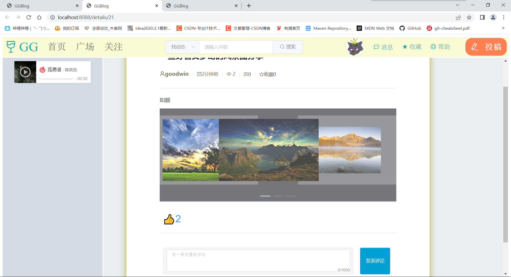
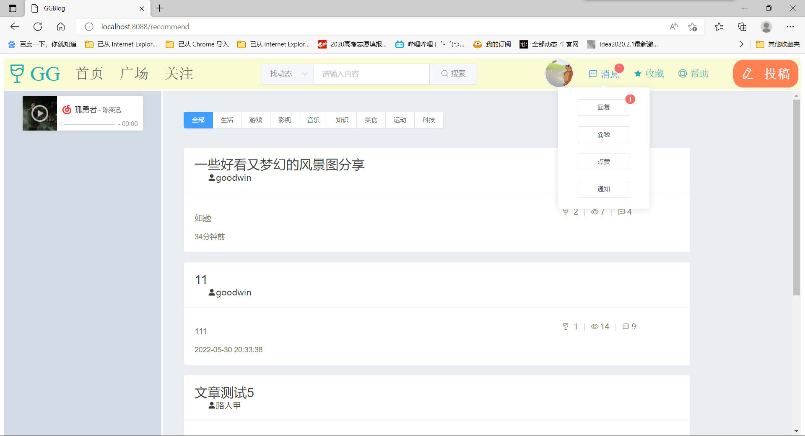

# ggblog
项目ggblog是个人项目，实现了前后端分离，前端采用了vue + elementUI实现，后端使用了SSM框架，
数据库使用MySQL进行数据存储。事务部分利用 Spring 的声明式事务管理。

本项目是ggblog前后端分离的后端部分，该部分实现了后端对数据的处理。

该部分使用了vue + elementUI实现，实现了以下功能的展示：

## 1.用户板块
>包括了用户的注册、登录、注销、修改个人信息

### 1.1用户注册
 输入用户名，通过异步请求检查用户名，发现用户名重复时，将进行提示
 
 用户名未被注册，则可以进行正常注册
 
 注册成功
 
### 1.2用户登录
正确输入密码，点击登录
 
### 1.3用户注销
登录成功后，可以通过点击头像下的“退出登录”进行用户注销
 
也可以点击“个人中心”进入个人中心，进行用户信息修改
### 1.4修改个人信息
进入个人中心
 
修改个人信息
 
 
 

## 2.动态相关
### 2.1发表动态
点击“投稿”进行动态投稿,编辑动态信息，可以设置动态标题，编辑动态内容，上传图片，进行动态分类
 
 
### 2.2查看动态
在“广场”查看到本站所有动态
 
在“关注”可以查看自己关注列表下的动态内容
 
可以在个人中心的“投稿信息”，查看自己已发布的动态信息
 
进入动态，查看具体内容，其中图片使用走马灯的形式进行展示
 
### 2.3搜索动态
在本项目中，可以通过异步请求，根据用户输入，提示存在的动态的标题；也可以进行模糊查询
 
 
也可以根据动态类型进行搜索
 
### 2.4点赞动态
进入动态后，可以进行点赞动态
 
### 2.5评论动态
 
 

## 3.评论相关
### 3.1评论动态
如上述**2.5评论动态**
### 3.2回复评论
点击评论下的“回复”按钮进行回复
 
### 3.3点赞评论
 
### 3.4查看评论和回复
可以展开评论下的回复，查看详细回复
 
### 3.5消息提醒
收到新的回复、评论或点赞时，在“消息”中进行提示，可以进入个人中心的“消息管理”模块中查看新消息
 
 
 

## 4.粉丝模块

### 4.1关注用户
进入其他用户的用户首页，可以进行用户关注
 
### 4.2查看关注
在个人中心的“粉丝系统”下可以查看用户的关注列表
 
### 4.3查看粉丝
在个人中心的“粉丝系统”下可以查看用户的粉丝列表
 

## 5.其他
### 5.1使用组件开发
本项目的前端，采用组件化的思想开发的，组件可以提升整个项目的开发效率。能够把页面抽象成多个相对独立的模块，解决了我们传统项目开发：效率低、难维护、复用性低等问题。
 
 
### 5.2文件上传
本项目中主要是动态中图片和用户头像的上传。

